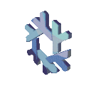

# Duds, the Shadow.
## - Profession -
Student of hextec at the wizard tower of [Roadmapland](https://roadmap.sh/u/xaviduds).

## - Class -
*Primary*: Backend Sourcerer (Novice)

*Secondary*: Product Owner (Intermediate)

## - Arsenal -
#### Ice Staff :
Made from flakes of Nixland's highest mountain's ice, infused with a crystal containing Tux, the Penguin God's soul.  

#### Grimoire:
Hextec: *Python*, *JavaScript* (currently immersed in scrolls to master it)

Conjuration: *HTML*

Ilusion: *CSS*

Mundanology: *Excel*

## - Familiar -

### [Lince](https://github.com/lince-social/lince): A telepathic frost beast, lynx shaped, elephant hearted, snake scaled.

Being able to repeatedly mimic actions you delegate to it, at certain intervals, a Lince is a great companion. By being telepathic, it understands you, knows your spells, your needs, and what you can do for the needs of others. It can communicate with other beings to meet your needs and to arrange contributions to the needs of others, freely, for the love of magic, or with a price.
